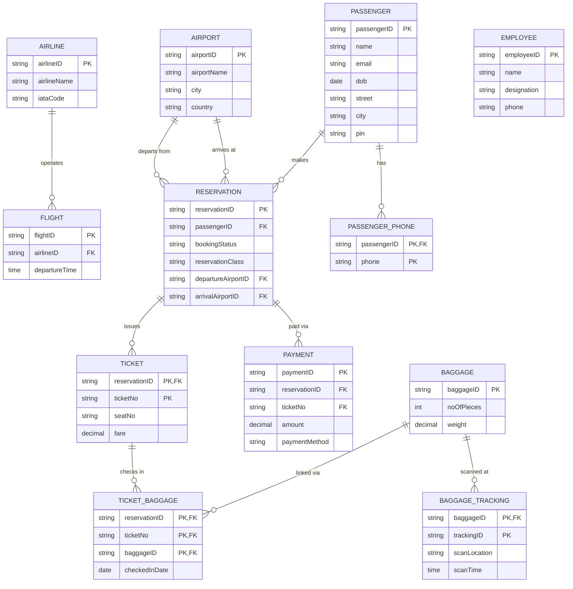

#  ✈️ Airline Reservation & Baggage Tracking System

**A full-stack, database-driven web application for managing airline reservations, passengers, flights, ticketing, payments, and end-to-end baggage tracking.**

> **Course:** Database Management Systems (DA-2 Project)
> **Institution:** Vellore Institute of Technology, B.Tech CSE
> **Focus:** Relational database design, normalization, and REST API engineering on top of a rigorously modeled MySQL schema.

---

## 1. Project Overview

The **Airline Reservation & Baggage Tracking System** is a three-tier application that centralizes the operational data of an airline around a single, normalized relational database. Rather than treating passengers, flights, reservations, tickets, payments, and baggage as independent, loosely-coupled records, the system models them — and the relationships between them — as a coherent relational schema, then exposes that schema to the outside world through a Spring Boot REST API and a browser-based operations dashboard.

The project was built to demonstrate, in a working full-stack context, the complete database engineering lifecycle taught in the DBMS coursework:

- Conceptual modeling with **Enhanced Entity-Relationship (EER)** diagrams
- Systematic **mapping of the EER model to a relational schema**
- Derivation of **functional dependencies** for every relation
- **Normalization up to Boyce-Codd Normal Form (BCNF)**
- Enforcement of **primary keys, composite keys, foreign keys, and referential integrity** at the schema level
- A production-style **JDBC data access layer** (Spring `JdbcTemplate`) that talks to the database using hand-written, auditable SQL rather than an ORM abstraction layer
- An **interactive SQL console** exposed through the API for direct query execution and schema inspection

The result is a system where the backend's Controller → Service → DAO layering is a direct reflection of the underlying relational design — every DAO method corresponds to a specific, deliberate SQL statement against a specific relation, making the database design decisions traceable all the way through to the API.

---

## 2. Database Engineering

The application layer exists to expose and exercise a database that was designed methodically, not incidentally.

### 2.1 EER Modeling
The domain was first modeled as an Enhanced Entity-Relationship diagram capturing:
- **Strong entities:** `Airline`, `Airport`, `Flight`, `Passenger`, `Reservation`, `Employee`
- **Weak / associative entities** used to correctly represent multivalued attributes and many-to-many relationships rather than forcing them into a single flat table, including:
  - `PassengerPhone` — models a passenger's multivalued phone-number attribute as its own relation, keyed on `(passengerID, phone)`
  - `Ticket` — the association between a `Reservation` and its issued tickets, keyed on `(reservationID, ticketNo)`
  - `Baggage` and `BaggageTracking` — baggage items and their multi-scan tracking history, keyed on `(baggageID, trackingID)`
  - `TicketBaggage` — the many-to-many link between tickets and checked baggage, keyed on `(reservationID, ticketNo, baggageID)`
  - `Payment` — tied to a specific `Reservation`/`Ticket` pair

### 2.2 Relational Schema Mapping
The EER model was mapped to relational tables following standard mapping rules: strong entities became base relations with single-attribute or composite primary keys; multivalued attributes (e.g., passenger phone numbers) were extracted into their own relations rather than being denormalized into repeating columns; and many-to-many relationships (e.g., tickets ↔ baggage) were resolved into bridge/associative relations carrying composite primary keys built from the foreign keys of the participating entities.

### 2.3 Functional Dependencies & Normalization
Each relation was analyzed for its functional dependencies (e.g., `FlightID → AirlineID, DepartureTime`; `ReservationID, TicketNo → SeatNo, Fare`; `BaggageID, TrackingID → ScanLocation, ScanTime`) to identify candidate keys and eliminate:
- **Partial dependencies** (2NF) — attributes depending on only part of a composite key
- **Transitive dependencies** (3NF) — non-key attributes depending on other non-key attributes
- **Anomalous determinants** (BCNF) — every non-trivial functional dependency's left-hand side confirmed to be a superkey

The schema was carried through **1NF → 2NF → 3NF → BCNF**, with associative entities such as `TicketBaggage` and `PassengerPhone` existing specifically to keep the design in normal form rather than storing repeating or multivalued groups inline.

### 2.4 Integrity & Constraints
- Composite primary keys are used wherever a relation's identity is inherently compound (`BaggageTracking`, `PassengerPhone`, `Ticket`, `TicketBaggage`).
- Foreign keys enforce referential integrity across every relationship (e.g., `Reservation.passengerID → Passenger`, `Reservation.departureAirportID / arrivalAirportID → Airport`, `Flight.airlineID → Airline`).
- The database layer is accessed exclusively through parameterized `JdbcTemplate` queries (see `dao/` package), keeping every SQL statement explicit and reviewable rather than generated implicitly by an ORM.

### 2.5 Interactive SQL Console
A dedicated `SqlController` (`/api/sql/**`) exposes ad-hoc query execution, live schema/table introspection (`information_schema`), and row-level browsing of any table — allowing the normalized schema, its constraints, and its data to be inspected and queried directly from the frontend as a demonstration/evaluation tool, with basic safeguards against destructive server- and database-level statements (`DROP DATABASE`, `GRANT`, `CREATE USER`, etc.).

---

## 3. Technology Stack

| Layer | Technology |
|---|---|
| Backend Framework | **Java 25**, **Spring Boot 4.1.1** (Spring Web MVC) |
| Build & Dependency Management | **Apache Maven**, with the Maven Wrapper (`mvnw` / `mvnw.cmd`) |
| Data Access | **Spring JDBC (`JdbcTemplate`)** — direct, parameterized SQL (no JPA/Hibernate abstraction) |
| Database | **MySQL** (via `mysql-connector-j`), connection pooled with **HikariCP** |
| Validation | Spring Boot Starter Validation |
| Frontend | **Vanilla HTML5, CSS3, and JavaScript** (no frontend framework) |
| Dev Tooling | Spring Boot DevTools (hot reload) |

**Architecture:**

```text
┌─────────────────────────────────────────────┐
│                  FRONTEND                    │
│       HTML + CSS + Vanilla JavaScript        │
│    index.html (landing) · dashboard.html     │
└─────────────────────────────────────────────┘
    │  HTTP / REST (JSON)
    ▼
┌─────────────────────────────────────────────┐
│                   BACKEND                    │
│           Java 25 + Spring Boot 4            │
│  Controller → Service → DAO → JdbcTemplate   │
└─────────────────────────────────────────────┘
    │  JDBC
    ▼
┌─────────────────────────────────────────────┐
│                  DATABASE                    │
│       MySQL — schema: airline_system         │
└─────────────────────────────────────────────┘
```

**Entity-Relationship Diagram:**



---

## How It Works (Typical User Flow)

While the API exposes full CRUD on every entity, the dashboard is built around one core operational flow:

1. **Register a passenger** — `POST /api/passengers`, with phone numbers added separately via `POST /api/passenger-phones` (kept as its own relation since a passenger can have more than one).
2. **Create a reservation** — `POST /api/reservations` links a passenger to a route (departure/arrival airport) and sets an initial `bookingStatus` and travel `class`.
3. **Issue a ticket** — `POST /api/tickets` attaches a ticket number, seat, and fare to that reservation.
4. **Record payment** — `POST /api/payments` logs the amount and method against the reservation/ticket.
5. **Check in baggage** — `POST /api/baggage` registers the bag (piece count, weight), and `POST /api/ticket-baggage` links it to the ticket with a check-in date.
6. **Track baggage** — as the bag moves through the airport, `POST /api/baggage-tracking` adds scan events (location + time) against that `baggageID`, building a full movement history.
7. **Operational/admin views** — `Employee` records represent staff able to manage the system, and the **SQL Console** (`/api/sql`) lets an admin inspect any table or run ad-hoc queries directly against the live database from the browser.

On the frontend, `index.html` is the landing/operations page showing live counts and quick links; clicking into a module routes (via `dashboard-router.js`, using the URL hash) into the relevant section of `dashboard.html`, where `script.js` drives the actual forms, tables, and API calls for that step of the flow above.

---

## 4. Core Functionalities

The REST API is organized as one Controller → Service → DAO stack per entity, each exposing standard CRUD endpoints under `/api/**`:

- **Flight Management** (`/api/flights`) — create, update, and query flight records, including airline association and departure time.
- **Passenger Management** (`/api/passengers`, `/api/passenger-phones`) — passenger profile CRUD, with multivalued phone numbers managed as a separate related resource.
- **Reservation & Booking** (`/api/reservations`) — flight booking workflow linking a passenger to a reservation, tracking booking status, class, and departure/arrival airports.
- **Ticketing** (`/api/tickets`) — ticket issuance per reservation, including seat assignment and fare.
- **Baggage & Baggage Routing** (`/api/baggage`, `/api/baggage-tracking`, `/api/ticket-baggage`) — baggage registration (piece count, weight), check-in association with tickets, and a full scan/location history for tracking a bag's journey through the system.
- **Payment Processing** (`/api/payments`) — recording payments against a reservation/ticket, including amount and payment method.
- **Employee & Access Management** (`/api/employees`) — employee records with designation and contact details, representing staff/administrative access to the system.
- **Airline & Airport Reference Data** (`/api/airlines`, `/api/airports`) — master data for carriers and airports.
- **SQL Console** (`/api/sql`) — ad-hoc SQL execution and live table/column/data introspection for the entire schema.

The **frontend dashboard** (`dashboard.html` + `script.js` + `dashboard-router.js`) consumes these APIs to provide an operational UI — a landing/operations page (`index.html` + `airport-home.js`) that surfaces live counts and routes into specific dashboard modules (e.g., flights, reservations, baggage) via URL-hash-based navigation.

---

## 5. Installation & Setup

### Prerequisites
- **JDK 25** (or later, matching `pom.xml`'s `<java.version>`)
- **MySQL Server 8.0+**
- Maven is *not* required to be installed separately — the project ships the **Maven Wrapper** (`mvnw`)

### 5.1 Clone the repository

```bash
git clone https://github.com/<your-username>/Airline-Reservation-Baggage-System.git
cd Airline-Reservation-Baggage-System
```

### 5.2 Provision the database

Create the schema and an application user in MySQL, matching the credentials expected by `backend/src/main/resources/application.properties` (adjust as needed):

```sql
CREATE DATABASE airline_system;
CREATE USER 'airline_app'@'localhost' IDENTIFIED BY 'your_password_here';
GRANT ALL PRIVILEGES ON airline_system.* TO 'airline_app'@'localhost';
FLUSH PRIVILEGES;
```

Then create the tables (`Airline`, `Airport`, `Flight`, `Passenger`, `PassengerPhone`, `Reservation`, `Ticket`, `Baggage`, `BaggageTracking`, `TicketBaggage`, `Payment`, `Employee`) according to the BCNF-normalized schema described in Section 2, with primary/foreign keys matching the field names used in the DAO layer (e.g., `FlightID`, `AirlineID`, `DepartureTime` for `FLIGHT`). Once the backend is running, the built-in **SQL Console** (`/api/sql/execute`) can also be used to run and verify DDL directly against the connected database.

### 5.3 Configure the connection

Update `backend/src/main/resources/application.properties` with your local database credentials:

```properties
spring.datasource.url=jdbc:mysql://localhost:3306/airline_system?useSSL=false&serverTimezone=Asia/Kolkata&allowPublicKeyRetrieval=true
spring.datasource.username=airline_app
spring.datasource.password=your_password_here
spring.datasource.driver-class-name=com.mysql.cj.jdbc.Driver
```

> ⚠️ **Note:** Do not commit real credentials. Prefer environment variables or a local `.env`/`application-local.properties` override that is excluded via `.gitignore`.

### 5.4 Run the backend (Spring Boot via Maven Wrapper)

From the `backend/` directory:

```bash
cd backend

# macOS / Linux
./mvnw spring-boot:run

# Windows
mvnw.cmd spring-boot:run
```

The API will start on **`http://localhost:8080`**, exposing all endpoints under `/api/**`.

To instead build and run a packaged JAR:

```bash
./mvnw clean package
java -jar target/airline-system-0.0.1-SNAPSHOT.jar
```

### 5.5 Serve the frontend

The frontend is a static HTML/CSS/JS bundle with no build step. Serve it from the `frontend/` directory using any static file server, for example:

```bash
cd frontend

# Using VS Code Live Server (default port 5500) — matches the backend's
# configured CORS origins (http://localhost:5500 / http://127.0.0.1:5500)
# or, alternatively, Python's built-in server:
python -m http.server 5500
```

Then open **`http://localhost:5500/index.html`** in your browser. The landing page links into `dashboard.html`, which drives all reservation, flight, passenger, baggage, and payment operations against the running backend at `http://localhost:8080/api`.

---

## Repository Structure

```text
Airline-Reservation-Baggage-System/
├── backend/
│   ├── mvnw, mvnw.cmd              # Maven Wrapper
│   ├── pom.xml                     # Maven project descriptor
│   └── src/main/java/com/airline/system/
│       ├── controller/             # REST controllers (one per entity + SqlController)
│       ├── service/                # Business logic layer
│       ├── dao/                    # JdbcTemplate-based data access layer
│       ├── model/                  # Entity POJOs
│       └── exception/              # Centralized error handling
└── frontend/
    ├── index.html, airport-home.js/css   # Landing / operations home page
    ├── dashboard.html, script.js         # Main operations dashboard
    └── dashboard-router.js               # Hash-based navigation into dashboard modules
```
